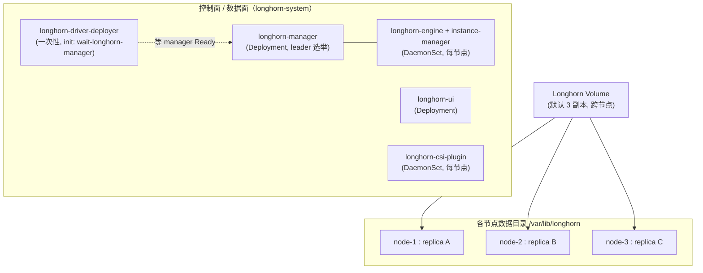
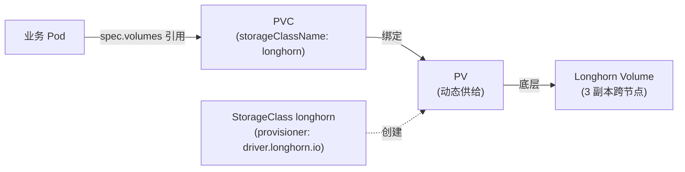

# 离线部署 Longhorn 分布式块存储

> 适用场景：无法访问公网 / 公网镜像仓库的内网、隔离环境，已按 `k8s-offline-manual-deploy.md` 拉起 K8s 集群（此处基于 **openEuler 24 + containerd + K8s 1.32.x**），需要一套**轻量级分布式块存储**给有状态应用兜底（PVC 跨节点复制、在线扩容、卷快照）。
>
> 本文示例版本以 **Longhorn v1.8.1** 为准；实际部署前请从目标 release 的 `longhorn-images.txt` 取**精确镜像清单与版本**（见第 3 节），不要硬编码。
>
> 与 Milvus 的关系：见第 8 节。一句话——**Longhorn 适合给「自身没做复制」的有状态应用兜底；MinIO/etcd 自带复制的，形态 A 下不叠 Longhorn**（详见 `milvus-offline-deploy.md`）。

---

## 1. 架构与组件概览

Longhorn 在 K8s 里由以下组件构成（都在 `longhorn-system` 命名空间）：

| 组件 | 类型 | 镜像（示例 v1.8.1） | 跑在哪 |
|---|---|---|---|
| `longhorn-manager` | Deployment（replicas=1，leader 选举） | `longhornio/longhorn-manager` | 仅 1 个节点（leader） |
| `longhorn-ui` | Deployment（replicas=1） | `longhornio/longhorn-ui` | 任意节点 |
| `longhorn-engine` / `longhorn-instance-manager` | DaemonSet（**每节点一个**） | `longhornio/longhorn-engine` / `longhornio/longhorn-instance-manager` | **每个节点都跑**（含 master） |
| `longhorn-csi-plugin` (provisioner/attacher/resizer/snapshotter/node-driver-registrar) | CSI Sidecar | `longhornio/csi-*` 或 `registry.k8s.io/sig-storage/*` | 每节点（DaemonSet）+ 少量 controller |
| `longhorn-share-manager` | DaemonSet（按需） | `longhornio/longhorn-share-manager` | 提供 RWX 共享卷的节点 |
| `longhorn-driver-deployer` | Deployment（一次性） | 同 manager 镜像 | 把 CSI driver 注册进集群（含 init 容器 `wait-longhorn-manager`） |

**核心概念**：
- 一个 **Longhorn 卷（Volume）** = 默认 **3 个副本（replica）**，分散在**不同节点**的 `/var/lib/longhorn` 数据目录下，写时同步到所有副本。
- 它对外暴露一个 **StorageClass `longhorn`**；你的 PVC 写 `storageClassName: longhorn` 即可动态拿到一块跨节点复制的盘。
- **与 local-path 的区别**：local-path 的 PVC 绑死在单节点、无复制；Longhorn 的 PVC 底层是 3 副本跨节点，节点挂了数据不丢、还能在线扩容。

### 1.1 组件与数据流总览



### 1.2 PV / PVC / StorageClass 与 Longhorn 的关系



> Pod 永远只跟 PVC 打交道；至于底层是 Longhorn 还是 local-path，**对 Pod 透明**——换 `storageClassName` 即可切换，应用无需改动。

---

## 2. 节点前置依赖（**每个节点**都要做，含 master）

Longhorn 依赖节点上的 iSCSI 与 NFS 栈。任一节点缺依赖，挂载卷就会失败。

```bash
# openEuler 用 dnf
dnf install -y iscsi-initiator-utils nfs-utils jq cryptsetup   # cryptsetup 仅加密卷需要

# 启动 iscsi 守护进程（关键！）
systemctl enable --now iscsid

# 加载内核模块
modprobe iscsi_tcp
modprobe dm_multipath        # 可选，但官方建议
echo -e "iscsi_tcp\ndm_multipath" > /etc/modules-load.d/longhorn.conf   # 开机自动加载（openEuler 走 systemd-modules-load）
```

> ⚠️ **离线校验清单**：确认 `iscsid` 状态 `active (running)`；确认 `lsmod | grep iscsi_tcp` 有输出。否则后面 PVC 一直 `ContainerCreating` 卡在 attach。

### 2.1 数据盘（生产建议：独立盘）

每个 worker 单独挂一块盘到 `/var/lib/longhorn`（或在该目录建独立 LV），**不要和系统盘混用**。Longhorn 默认把所有副本写在这个目录，系统盘写满会拖垮整个节点。

```bash
# 示例：把一块独立盘 /dev/sdb 挂到 /var/lib/longhorn
mkfs.ext4 /dev/sdb
mkdir -p /var/lib/longhorn
echo '/dev/sdb /var/lib/longhorn ext4 defaults 0 0' >> /etc/fstab
mount -a
```

### 2.2 VM / 单盘实验环境（混用系统盘也行）

虚拟机里往往只有一块 `/dev/sda`。实验阶段**直接混用系统盘没问题**，但要把 Longhorn 对默认盘的「保留空间」调大，避免它误以为整块盘都能用（见第 5 节 `storageReservedPercentageForDefaultDisk` 设 40~50）。

如果想在 VM 里也跑"独立盘"的规范拓扑（和生产只有容量区别），用 **loop 文件**模拟一块独立盘：

```bash
# 建一个 20G 稀疏文件（实际占用随写入增长；大小按实验调）
truncate -s 20G /longhorn.img
mkfs.ext4 /longhorn.img
mkdir -p /var/lib/longhorn
mount -o loop /longhorn.img /var/lib/longhorn
# 开机自动挂（loop 选项让 mount 自己分配 loop 设备）
echo '/longhorn.img /var/lib/longhorn ext4 loop 0 0' >> /etc/fstab
mount -a
df -h /var/lib/longhorn
```

> 诚实提醒：loop 文件底层仍是 `/dev/sda` 上的一个大文件，没有真正硬件隔离；但它给了干净独立挂载点 + 独立文件系统，足以完整练 Longhorn 拓扑。
> 想完全模拟生产：给 VM 加一块虚拟盘（VirtualBox/VMware/KVM 一键添加），出现 `/dev/sdb` 后按 2.1 挂载即可。
> VM 实验的固有局限：若 3 个 VM 同在一台宿主，副本逻辑跨节点但物理同盘，没有真正硬件容错——API 行为能验证，抗硬件故障验证不了。

---

## 3. 离线镜像准备（核心步骤）

Longhorn 镜像分两类来源：
- `longhornio/*`（Docker Hub）→ 走 `docker.m.daocloud.io` 镜像
- `registry.k8s.io/sig-storage/*`（K8s 官方 CSI sidecar）→ 走 `k8s.m.daocloud.io` 镜像

### 3.1 拿到精确镜像清单（不要凭记忆写）

在有网机器上，从目标 release 取官方清单：

```bash
curl -L https://raw.githubusercontent.com/longhorn/longhorn/v1.8.1/deploy/longhorn-images.txt -o longhorn-images.txt
cat longhorn-images.txt
```

> 文件内容形如：
> ```
> longhornio/longhorn-manager:v1.8.1
> longhornio/longhorn-ui:v1.8.1
> longhornio/longhorn-engine:v1.8.1
> longhornio/longhorn-instance-manager:v1.8.1
> longhornio/longhorn-share-manager:v1.8.1
> longhornio/csi-provisioner:v5.0.1
> longhornio/csi-attacher:v4.6.1
> longhornio/csi-resizer:v1.11.1
> longhornio/csi-snapshotter:v8.1.1
> longhornio/csi-node-driver-registrar:v2.12.0
> longhornio/livenessprobe:v2.14.0
> ```
> （不同版本 CSI sidecar 可能在 `registry.k8s.io/sig-storage/` 前缀下，脚本会自动识别两类前缀。）

### 3.2 有网机拉取 + 打回原 tag + 打包

把下面的脚本保存为 `pull-longhorn.sh`，在**有网机**执行：

```bash
#!/usr/bin/env bash
set -e
DOCKER_MIRROR=docker.m.daocloud.io            # 备选：docker.1ms.run / hub.rat.dev / dockerpull.com
K8S_MIRROR=k8s.m.daocloud.io                  # 备选：registry.aliyuncs.com/google_containers

LIST=longhorn-images.txt
OUT_TAR=longhorn-images-v1.8.1.tar

curl -sI https://${DOCKER_MIRROR}/v2/ | head -1
curl -sI https://${K8S_MIRROR}/v2/ | head -1

TMP=()
while IFS= read -r img; do
  [ -z "$img" ] && continue
  case "$img" in
    longhornio/*)
      mirror="${DOCKER_MIRROR}/${img}" ;;
    registry.k8s.io/*)
      sub=${img#registry.k8s.io/}
      mirror="${K8S_MIRROR}/${sub}" ;;
    *)
      mirror="${DOCKER_MIRROR}/${img}" ;;
  esac
  echo "==> pull ${mirror}  -> tag ${img}"
  docker pull "${mirror}" || { echo "FAILED: ${mirror}"; exit 1; }
  docker tag  "${mirror}" "${img}"
  TMP+=("${img}")
done < "$LIST"

docker save -o "${OUT_TAR}" "${TMP[@]}"
echo "saved -> ${OUT_TAR}"
ls -lh "${OUT_TAR}"
```

执行：
```bash
bash pull-longhorn.sh
# 产出 longhorn-images-v1.8.1.tar（约 1.5~2.5 GB，视版本）
```

> ⚠️ **架构必须一致**：有网机拉取的镜像架构（amd64/aarch64）必须和目标集群节点一致，否则 `ctr import` 后 Pod 报架构不匹配。用 `docker pull --platform linux/amd64 ...` 可强制（多架构镜像时）。

### 3.3 分发 + 各节点导入（关键：每个节点都要导）

把 `longhorn-images-v1.8.1.tar` 拷到**每一个节点**（master + 所有 worker），因为 Longhorn 的 DaemonSet 在每节点都跑 engine/instance-manager，manager/UI/CNI 也要在调度节点本地有镜像。

```bash
# 在每个节点上（containerd 命名空间 k8s.io，和 kubeadm 一致）
ctr -n k8s.io images import longhorn-images-v1.8.1.tar

# 校验（应能看到 longhornio/* 与 registry.k8s.io/sig-storage/*）
ctr -n k8s.io images list | grep -E 'longhornio|sig-storage'
```

> 💡 **规模提示**：6 worker 集群 = 7 个节点都要导入。嫌逐节点分发麻烦，可改用第 4.4 节的**私有镜像仓库**方案，节点只需能访问仓库、无需逐机导入。

---

## 4. 部署

### 4.1 方式 A：kubectl manifest（推荐，最简单，纯离线友好）

单个 YAML 包含全部 RBAC + 组件 + StorageClass + **CRD**，离线最省心。

```bash
# 有网机下载（或你已把该文件随镜像一起拷入内网）
curl -L https://raw.githubusercontent.com/longhorn/longhorn/v1.8.1/deploy/longhorn.yaml -o longhorn.yaml

# 内网 master 上直接 apply（所有镜像已在各节点本地，不会去公网拉）
kubectl apply -f longhorn.yaml

# ⚠️ 该完整清单已内置全部 Longhorn CRD（engineimages / volumes / replicas …），
#    一条 apply 即可，无需再单独 apply 任何 CRD 文件。
#    若你用方式 B 渲染的静态 yaml 报 CRD 缺失，那是 helm template 默认不输出 CRD 所致，
#    请按 4.3 加 --include-crds 重新渲染（不要用单独的 longhorn-crd.yaml，该文件在官方仓库并不存在）。
```

等待所有 Pod 就绪：
```bash
kubectl -n longhorn-system get pods -w
# 期望：longhorn-manager-* Running、longhorn-ui-* Running、
#       longhorn-csi-* (DaemonSet) 每节点 Running、instance-manager-* Running
```

### 4.2 方式 A 进阶：部署前改默认副本数 / 数据目录

在 `kubectl apply` 之前改 `longhorn.yaml` 里的 ConfigMap `longhorn-storageclass` 和 `longhorn-default-setting`：

```yaml
# StorageClass 默认副本数（默认 3；只有 2 worker 时建议改成 2）
apiVersion: storage.k8s.io/v1
kind: StorageClass
metadata:
  name: longhorn
provisioner: driver.longhorn.io
parameters:
  numberOfReplicas: "3"        # ← 改成你要的值（见第 5 节节点数约束）
  staleReplicaTimeout: "30"
allowVolumeExpansion: true     # Longhorn 原生支持在线扩容
```

### 4.3 方式 B：Helm 离线部署

适合你已用 Helm 管理 Milvus、想统一工具链的场景。

```bash
# 有网机：拉 chart 包（不联网装，只下载）
helm repo add longhorn https://charts.longhorn.io
helm pull longhorn/longhorn --version 1.8.1 --untar

# 渲染成静态 yaml
# ⚠️⚠️ 必须加 --include-crds：helm template 默认【不】把 CRD 渲染进输出文件，
#    漏掉它会导致 longhorn-rendered.yaml 里没有 CRD → apply 后 manager 因
#    "failed to list EngineImage" 永远不就绪、driver-deployer 卡在 init 阶段。
helm template longhorn ./longhorn \
  --namespace longhorn-system --create-namespace \
  --include-crds \
  --set defaultSettings.defaultReplicaCount=3 \
  --set persistence.defaultClassReplicaCount=3 \
  > longhorn-rendered.yaml

# 内网 master 应用渲染结果（此时已含 CRD）
kubectl apply -f longhorn-rendered.yaml
```

> 如果之前已经渲染过（漏了 `--include-crds` 且集群已卡在缺 CRD），**不用重渲染**，直接补 apply chart 自带的 CRD 即可：
> ```bash
> kubectl apply -f ./longhorn/chart/crds.yaml   # chart 解压目录里的 crds
> kubectl apply -f longhorn-rendered.yaml        # 你已有的渲染文件（重 apply 不会破坏已建组件）
> ```
> manager 会自动重新 list 成功 → 变 Ready → driver-deployer 的 init 通过。

> 若你用**私有镜像仓库**（见 4.4），渲染时加 `--set image.longhorn.repository=registry.local:5000/longhornio` 等，或 `helm template` 后 `sed` 替换镜像前缀。

### 4.4 方式 C（可选，大规模推荐）：私有镜像仓库

当节点多（如 6 worker），逐机 `ctr import` 太累，可搭一个内网 registry（你为 K8s 大概率已有），把 Longhorn 镜像 `docker push` 进去，再让 manifest 引用它：

```bash
# 有网机：把镜像 push 到内网仓库（示例 registry.local:5000）
while IFS= read -r img; do
  [ -z "$img" ] && continue
  case "$img" in
    longhornio/*)       new="registry.local:5000/${img}" ;;
    registry.k8s.io/*)  new="registry.local:5000/${img#registry.k8s.io/}" ;;
    *) continue ;;
  esac
  docker tag "$img" "$new"
  docker push "$new"
done < longhorn-images.txt

# 内网：把 longhorn.yaml 里的镜像前缀替换成私有仓库
sed -i \
  -e 's#longhornio/#registry.local:5000/longhornio/#g' \
  -e 's#registry.k8s.io/sig-storage/#registry.local:5000/sig-storage/#g' \
  longhorn.yaml
kubectl apply -f longhorn.yaml
```

---

## 5. 关键配置（StorageClass / 副本调度）

装好后有几个值决定数据安全与性能，建议首次就定好（Helm 用 `--set`，manifest 改 ConfigMap）：

| 参数 | 推荐值 | 说明 |
|---|---|---|
| `defaultReplicaCount` | 3 | 卷默认副本数。容忍 (N-1) 节点挂，详见下 |
| `replicaAutoBalance` | "least-effort" | 新副本尽量打散到不同节点 |
| `storageOverProvisioningPercentage` | 100 | 防止超卖 |
| `storageReservedPercentageForDefaultDisk` | 15~25（VM 混用系统盘设 40~50） | 每盘预留，防写满 |
| `defaultDataLocality` | "best-effort" | 尽量把一个副本放在使用卷的 Pod 同节点，降延迟 |
| `taintToleration` | 默认容忍 control-plane | 见下「节点数约束」 |

**节点数约束（重要）**：
- 副本数默认 3 → **至少要有 3 个能放副本的节点**。
- 你若保持 master 的 `control-plane` taint 且**不让 master 存数据**，则 1 master + 2 worker 只有 2 个数据节点 → 3 副本放不下，卷会一直 `Degraded`/建不出来。两种解法：
  1. 把副本数降到 **2**（`numberOfReplicas: "2"`，容忍 1 节点挂，和 etcd 3 副本容 1 同理）；或
  2. 允许 master 参与 Longhorn（Longhorn DaemonSet 默认**容忍** control-plane taint，会往 master 也放副本），则 1+2=3 节点满足 3 副本。
- **生产（1 master + 6 worker）**：3 副本毫无压力；想更稳可上 3 副本 + 严格反亲和（`replicaZoneSoftAntiAffinity: false` 强制跨区/跨节点）。

---

## 6. 验证

```bash
# 1. 组件全 Running
kubectl -n longhorn-system get pods

# 2. StorageClass 已就绪
kubectl get sc longhorn

# 3. 建一个测试 PVC + Pod 挂载，验证读写与副本
cat <<'EOF' | kubectl apply -f -
apiVersion: v1
kind: PersistentVolumeClaim
metadata:
  name: longhorn-test
spec:
  accessModes: [ReadWriteOnce]
  storageClassName: longhorn
  resources:
    requests:
      storage: 1Gi
---
apiVersion: v1
kind: Pod
metadata:
  name: longhorn-test
spec:
  containers:
  - name: vol
    image: registry.k8s.io/pause:3.10
    command: ["sleep", "3600"]
    volumeMounts:
    - name: data
      mountPath: /data
  volumes:
  - name: data
    persistentVolumeClaim:
      claimName: longhorn-test
EOF

kubectl exec longhorn-test -- sh -c 'echo hello > /data/x && cat /data/x'
# 去 Longhorn UI 看该卷副本分布在哪些节点、是否 Healthy
kubectl delete pod longhorn-test --ignore-not-found
kubectl delete pvc longhorn-test --ignore-not-found
```

**访问 Longhorn UI**（任选其一）：
```bash
kubectl -n longhorn-system port-forward svc/longhorn-ui 8080:80
# 浏览器开 http://<master-ip>:8080
```

---

## 7. 状态检查、健康判断与排障决策树

装好之后（或出问题时）按下面四层从粗到细判断。**绝大多数故障都能在这棵树里定位**。

### 7.1 四层状态检查

```bash
# ① 组件 Pod 是否全 Running（最表层）
kubectl -n longhorn-system get pods -o wide
#   健康：manager/UI/csi-plugin/instance-manager 全 Running，无 ImagePullBackOff/CrashLoop

# ② 节点与磁盘是否 Ready（存储层）
kubectl -n longhorn-system get nodes.longhorn.io
#   每个节点应为 Ready；磁盘若 DiskPressure/NotReady = 盘满或没挂

# ③ 卷（Volume）状态（数据层——最该盯的）
kubectl -n longhorn-system get volumes.longhorn.io
#   见 7.2 健康度表

# ④ UI 看板（最直观）
kubectl -n longhorn-system port-forward svc/longhorn-ui 8080:80
#   Node / Volume / Replica 三页一眼看全貌
```

### 7.2 卷健康度判断

| 状态 | 含义 | 还能用吗 |
|---|---|---|
| **Healthy** | 所有副本就绪，副本数达标 | ✅ 完全正常 |
| **Degraded** | 有副本缺失（如某节点挂了），但数据可重建 | ⚠️ 能用，但无冗余，尽快恢复节点 |
| **Detached** | 卷没挂到任何 Pod（Pod 没起/被删） | 看业务，不一定是故障 |
| **Faulted** | 缺失副本数超过容错上限，**数据可能永久丢** | ❌ 严重，需从备份恢复 |

```bash
# 看某个卷的副本详情（几个 Healthy、几个 Missing）
kubectl -n longhorn-system get volumes.longhorn.io <volume名> -o yaml | grep -A8 "replicas:"
```

> 综合判健康：**所有 manager/csi Pod Running + 所有 node Ready + 所有 volume Healthy + 实际副本数 = 设定副本数** → 集群健康。出现 **Degraded** = 还能跑但已无冗余（常见于某 worker 宕机），要赶在第二个节点也挂之前恢复；**Faulted** = 已超出副本容错，只能靠备份。

### 7.3 排障决策树（按现象逐步定位）

#### A. `longhorn-driver-deployer` 卡在 `Init:0/1` / `PodInitializing`

这是离线部署最高频的问题。**卡住的往往不是 driver-deployer 本身**，而是它的 init 容器 `wait-longhorn-manager`（它要等 manager 就绪才启动主容器去部署 CSI driver）。

```
① 看 manager 是否真的就绪（Running ≠ Ready）
   kubectl -n longhorn-system get pods -o wide | grep longhorn-manager
   - READY 列 0/1 → manager 没就绪，进 ②
   - READY 列 1/1 → manager 已就绪，看 driver-deployer 的 init 日志/镜像（③）

② manager 0/1，看日志为什么没就绪
   kubectl -n longhorn-system logs -l app=longhorn-manager --tail=40
   - 出现 "failed to list *v1beta2.EngineImage" → ⛔ CRD 缺失，跳到 A-CRD
   - 出现 etcdserver / connection refused → manager 连不上 apiserver/etcd，查网络

③ manager 已 1/1，driver-deployer 仍卡 → 看 init 容器与镜像
   kubectl -n longhorn-system get pod longhorn-driver-deployer-xxx \
     -o jsonpath='{range .status.initContainerStatuses[*]}{.name}{" => "}{.state}{"\n"}{end}'
   - waiting / ImagePullBackOff → 该节点没导入 driver-deployer 镜像（见 B）
   - running 很久 → init 在等拉镜像，确认节点有 longhorn-manager 镜像
```

**A-CRD（manager 报 failed to list EngineImage）—— 集群缺 Longhorn CRD**

确认：
```bash
kubectl get crd | grep longhorn
kubectl api-resources | grep engineimage     # 为空 = CRD 确实缺失
```
根因与解法：
- **方式 A（你用的 `kubectl apply -f longhorn.yaml`）**：完整清单已内置 CRD，本不该缺。缺失几乎都是**第一次下载/apply 不完整**（curl 中断、apply 超时）。直接重跑即可（幂等，自动补 CRD）：
  ```bash
  kubectl apply -f longhorn.yaml
  ```
  若重跑后仍为空，先重新下载（文件可能残缺）：
  ```bash
  curl -L https://raw.githubusercontent.com/longhorn/longhorn/v1.8.1/deploy/longhorn.yaml -o longhorn.yaml
  wc -l longhorn.yaml        # 完整文件通常 1MB+ / 数千行
  kubectl apply -f longhorn.yaml
  ```
- **方式 B（Helm 渲染）**：`helm template` 默认**不输出 CRD**，漏了 `--include-crds` 所致。补 apply chart 自带 CRD：
  ```bash
  kubectl apply -f ./longhorn/chart/crds.yaml
  kubectl apply -f longhorn-rendered.yaml
  ```
  或重渲染加 `--include-crds`（见 4.3）。

> ⚠️ 不存在独立的 `longhorn-crd.yaml` 部署文件（官方 `deploy/longhorn-crd.yaml` 实测 404）。不要去下载它；方式 A 用完整 `longhorn.yaml`、方式 B 用 chart 里的 `chart/crds.yaml` 或 `--include-crds`。

apply 完 CRD 不用重启，等一两分钟：manager 自动变 `1/1` → driver-deployer 的 init 通过 → 整套正常。

#### B. 某个 Longhorn Pod `ImagePullBackOff` / `CrashLoopBackOff`

```bash
kubectl -n longhorn-system describe pod <pod名> | tail -25   # 看 Events 的 reason
```
- `Failed to pull image ...` → 该节点**没导入**对应镜像（离线头号原因）：
  ```bash
  ctr -n k8s.io images ls | grep <镜像名>     # 在该 Pod 调度到的节点执行
  # 没有就拷 tar 过去：ctr -n k8s.io images import longhorn-images-v1.8.1.tar
  ```
- `manager`/`ui` 报架构不匹配 → 有网机拉的镜像架构和节点不一致（见 3.2 架构说明）。

#### C. PVC 一直 `ContainerCreating`，事件报 attach 失败

```bash
kubectl describe pvc <pvc名>        # 看 Events
kubectl get nodes.longhorn.io -o yaml | grep -A6 "DiskStatus\|Conditions"   # 看磁盘
```
- attach 失败 / `iscsi` 相关 → 节点 `iscsid` 没起或内核模块没加载：
  ```bash
  systemctl enable --now iscsid      # 该节点
  modprobe iscsi_tcp
  ```
- 磁盘 `NotReady` → `/var/lib/longhorn` 没挂或盘满（见第 2 节）。

#### D. 卷状态 `Degraded`

```bash
kubectl -n longhorn-system get volumes.longhorn.io     # 看哪个 Degraded
kubectl -n longhorn-system get nodes.longhorn.io       # 看谁掉
```
- 通常是某 worker 挂了、副本缺失。**能跑但已无冗余**，恢复该节点即可自动重建副本。
- 若一直建不出卷（Pending）→ 节点数 < 副本数（如 2 worker 设了 3 副本）：副本数降到 2，或允许 master 参与（见第 5 节）。

#### F. PVC 建卷失败：`backup target default is not found`

现象：`kubectl describe pvc <pvc>` 的 Events 里反复 `ProvisioningFailed`，报错
`Failed to create volume ...: rpc error: code = Internal desc = "backup target default is not found"`，
Pod 卡 `ContainerCreating` / `unbound immediate PersistentVolumeClaims`。

根因：Longhorn 建卷时会查找名为 **`default`** 的 `BackupTarget` CR（`backuptargets.longhorn.io`）。
若 manager 启动初始化不全（离线部署不完整、CRD/默认对象缺失的同一类病根），这个 `default`
BackupTarget CR 实例没被创建，于是任何新卷都因"找不到默认备份目标"而 500 失败。
注意：这是 **CR 实例缺失**，不是 `settings.longhorn.io` 里的 `backup-target` 配置问题。

**前置：先确认 CRD 是否注册**（若 `get backuptargets.longhorn.io` 报 `no resource type 'backuptargets'`，说明 CRD 本身没进集群）
```bash
kubectl get crd | grep -E 'longhorn|backuptarget'
```
- 若 `backuptargets.longhorn.io` **不在列表** → 之前 `kubectl apply -f longhorn.yaml` 不完整（同 7.3-A 的病根：下载/apply 截断漏了一批 CRD）。直接重跑**完整** longhorn.yaml 补齐所有 CRD（幂等）：
  ```bash
  # 若本地 longhorn.yaml 可能残缺，先重新下载完整文件（正常 1MB+ / 数千行）
  curl -L https://raw.githubusercontent.com/longhorn/longhorn/v1.8.1/deploy/longhorn.yaml -o longhorn.yaml
  wc -l longhorn.yaml
  kubectl apply -f longhorn.yaml          # 补齐缺失的 CRD（含 backuptargets）
  kubectl get crd | grep backuptargets    # 确认已注册
  # 然后重启 manager，让它自动建 default BackupTarget CR
  kubectl -n longhorn-system rollout restart daemonset longhorn-manager
  ```

诊断（CRD 已注册时）：
```bash
kubectl -n longhorn-system get backuptargets.longhorn.io     # 看有没有名为 default 的 CR
kubectl -n longhorn-system logs -l app=longhorn-manager --tail=50 | grep -i "backup target"
```

解法（CRD 已注册、仅缺 default CR 实例时，二选一）：
- **方式 A（推荐，官方自愈）**：重启 manager 让它重新 bootstrap 默认对象
  ```bash
  kubectl -n longhorn-system rollout restart daemonset longhorn-manager
  # 等 1~2 分钟，不会卸载已挂载卷
  kubectl -n longhorn-system get backuptargets.longhorn.io   # 应出现 default
  ```
- **方式 B（手动建，立即见效）**：直接 apply 空 URL 的 default BackupTarget CR
  ```bash
  APIVER=$(kubectl get crd backuptargets.longhorn.io -o jsonpath='{.spec.versions[0].name}')
  kubectl -n longhorn-system apply -f - <<EOF
  apiVersion: longhorn.io/$APIVER
  kind: BackupTarget
  metadata:
    name: default
    namespace: longhorn-system
  spec:
    backupTargetURL: ""
  EOF
  ```
建好后 CSI provisioner 会自动重试 PVC，无需删 Pod。离线无对象存储，`backupTargetURL` 留空即可
（备份功能不可用，但建卷不再报错，功能验证够用）。

#### E. 扩容 PVC 后容量没变

```bash
kubectl edit pvc <pvc名>     # 把 spec.resources.requests.storage 调大
```
- Longhorn StorageClass 默认 `allowVolumeExpansion: true`，改完 kubelet 在线 resize 或 Pod 重启即生效。
- 若改不动 → 检查 SC 是否开了 `allowVolumeExpansion`（本地盘 SC 常默认 false）。

### 7.4 快速坑表（速查）

| 现象 | 根因 | 速解 |
|---|---|---|
| driver-deployer `Init:0/1` / PodInitializing | init `wait-longhorn-manager` 等 manager 就绪 | 进 7.3-A 链；多半是 manager 0/1 → CRD 缺失 |
| manager 0/1 + `failed to list EngineImage` | 集群缺 CRD（方式 A 下载不全 / 方式 B 漏 `--include-crds`） | 方式 A 重 `kubectl apply -f longhorn.yaml`；方式 B 补 `chart/crds.yaml` |
| `*-manager`/`csi-*` ImagePullBackOff | 该节点没导入镜像 | 该节点 `ctr import` tar |
| PVC `ContainerCreating` attach 失败 | `iscsid` 没起 / 内核模块没加载 | 装 iscsi + `modprobe iscsi_tcp` |
| 卷 `Degraded` | 节点数 < 副本数 / 某节点挂 | 副本降到 2 或恢复节点 |
| 建卷报 `backup target default is not found` | 默认 `BackupTarget` CR（`backuptargets.longhorn.io/default`）实例缺失（初始化不全） | `rollout restart daemonset longhorn-manager` 自愈，或手动建空 URL 的 default BackupTarget CR（见 7.3-F） |
| UI 打不开 / manager CrashLoop | manager 镜像没导入到调度节点 | 确认所有节点导入 `longhorn-manager` |
| 扩容后容量没变 | 没 `allowVolumeExpansion` | Longhorn 默认已开；`kubectl edit pvc` 调大 |
| openEuler 内核模块缺失 | 精简内核没编 iscsi_tcp | `dnf install -y kernel-devel` 或换标准内核 |

---

## 8. 与 Milvus 集成（接前面的讨论）

Longhorn 装好后，给 Milvus 的组件指定 `storageClassName: longhorn` 即可。两种形态：

**形态 B（MinIO standalone on Longhorn，运维最简，小规模推荐）**
把 MinIO 从分布式退成单 Pod 单 PVC，底层交给 Longhorn 复制：
```yaml
# Milvus chart values 示例
minio:
  replicas: 1
  persistence:
    enabled: true
    storageClass: longhorn      # ← 关键
    size: 100Gi                 # 不够了直接 kubectl edit pvc 调大（Longhorn 在线扩容）
```
MinIO 启动命令改成 `minio server /export`（无 `{0...N}`）。冗余责任从 MinIO EC 下沉到 Longhorn 卷复制，节点挂了数据不丢。**适合 1 master + 2 worker 这类小集群**。

**形态 A（Milvus 各组件自管冗余，Longhorn 基本不用）**
MinIO 分布式 EC on local-path、etcd Raft on local-path，Longhorn 不参与（见 `milvus-offline-deploy.md` 第 8 节与对话梳理）。

> 🔴 **铁律（生产）**：**MinIO 的 Erasure Coding 与 Longhorn 的卷副本绝不叠加**。Longhorn 3 副本 × MinIO EC 4+2(1.5x) = 4.5x 原始空间 + 写两次复制/校验，性能挨两刀。二选一：大数据/高吞吐 → MinIO 分布式 EC on 裸盘（不叠 Longhorn）；小集群想省心 → MinIO standalone on Longhorn。

---

## 9. 卸载 Longhorn 与 `Terminating` 卡死处理

> 离线环境重装常见。Longhorn 卸载最容易卡在命名空间 `Terminating` 永远删不掉，根因几乎都是 **admission webhook 配置残留** + **CR finalizer 残留**，下面按正确顺序清。

### 9.1 根因：为什么卡在 Terminating

执行删除后命名空间卡 `Terminating`，并出现 `service longhorn-admission-webhook not found` 之类报错，原因是：

- Longhorn 安装时创建了集群级的 `MutatingWebhookConfiguration` / `ValidatingWebhookConfiguration`（名字通常叫 `longhorn-admission-webhook`），其 webhook 地址指向 `longhorn-system` 命名空间里的 `longhorn-admission-webhook` 这个 **Service**。
- 当你 `kubectl delete -f longhorn.yaml` 时，这个 Service / Pod 先被删了，但 **webhook 配置（集群级资源，不在命名空间里）没跟着删干净**。
- 于是任何对 `longhorn-system` 命名空间中、带 finalizer 的 Longhorn CR（volume/engine/replica…）的删除或 patch 请求，都会被 kube-apiserver 转发给这个**已经不存在的 webhook** → 请求 hang 住/失败 → CR 删不掉 → finalizer 清不掉 → 命名空间永远 `Terminating`。
- 你直接对带 finalizer 的 CR 执行 patch/delete 时，也会因为 webhook 拦截而报 `service longhorn-admission-webhook not found` / 超时。

**结论：必须先删 webhook 配置，再清 CR finalizer，最后清命名空间 finalizer。** 顺序反了就互相卡死。

### 9.2 正确卸载顺序

**① 先删所有用到 Longhorn 的 PVC / 卷**（MinIO 若跑在 Longhorn 上，先停 MinIO 再删其 PVC）
```bash
kubectl get pvc --all-namespaces | grep -i longhorn
kubectl delete pvc <pvc-name> -n <ns>
```

**② 删 admission webhook 配置（在命名空间之外，是卡死根因，必须最先清）**
```bash
kubectl get mutatingwebhookconfigurations   | grep -i longhorn
kubectl get validatingwebhookconfigurations | grep -i longhorn
# 按上一步真实名字删除（常见名为 longhorn-admission-webhook）
kubectl delete mutatingwebhookconfiguration  longhorn-admission-webhook
kubectl delete validatingwebhookconfiguration longhorn-admission-webhook
```

**③ 清残留 Longhorn CR 的 finalizer**（webhook 没了，这次能成功）
```bash
for r in volumes engines replicas settings nodes instancemanagers backingsnapshots backups sharemanagers recurringjobs snapshots; do
  kubectl get ${r}.longhorn.io -n longhorn-system -o name 2>/dev/null \
    | xargs -r kubectl patch -n longhorn-system --type=merge -p '{"metadata":{"finalizers":[]}}'
done
```

**④ 清命名空间 finalizer**（用 jq 或 python，任选）
```bash
kubectl get ns longhorn-system -o json \
  | python3 -c 'import sys,json;d=json.load(sys.stdin);d["spec"]["finalizers"]=[];print(json.dumps(d))' \
  | kubectl replace --raw /api/v1/namespaces/longhorn-system/finalize -f -
```

**⑤ 清残留 CRD + 删组件（如之前没删干净）**
```bash
kubectl delete crd $(kubectl get crd -o name | grep longhorn)
kubectl delete -f longhorn.yaml        # 或 helm uninstall longhorn -n longhorn-system
```

**⑥ 各节点清盘（彻底干净重来才需要）**
```bash
# 每个节点
rm -rf /var/lib/longhorn
rm -f /longhorn.img                    # 若用 loop 文件方案
```

### 9.3 一句话记忆

删除顺序：**webhook 配置 → CR finalizer → 命名空间 finalizer → CRD**。卡 `Terminating` 十有八九是 webhook 配置还在指着一个已删的 Service。

---

## 10. 附录：镜像清单（示例 v1.8.1，以 `longhorn-images.txt` 为准）

| 镜像 | 来源 | 离线镜像 |
|---|---|---|
| `longhornio/longhorn-manager:v1.8.1` | Docker Hub | `docker.m.daocloud.io/longhornio/longhorn-manager:v1.8.1` |
| `longhornio/longhorn-ui:v1.8.1` | Docker Hub | `docker.m.daocloud.io/longhornio/longhorn-ui:v1.8.1` |
| `longhornio/longhorn-engine:v1.8.1` | Docker Hub | `docker.m.daocloud.io/longhornio/longhorn-engine:v1.8.1` |
| `longhornio/longhorn-instance-manager:v1.8.1` | Docker Hub | `docker.m.daocloud.io/longhornio/longhorn-instance-manager:v1.8.1` |
| `longhornio/longhorn-share-manager:v1.8.1` | Docker Hub | `docker.m.daocloud.io/longhornio/longhorn-share-manager:v1.8.1` |
| `longhornio/csi-provisioner:v5.0.1` | Docker Hub | `docker.m.daocloud.io/longhornio/csi-provisioner:v5.0.1` |
| `longhornio/csi-attacher:v4.6.1` | Docker Hub | `docker.m.daocloud.io/longhornio/csi-attacher:v4.6.1` |
| `longhornio/csi-resizer:v1.11.1` | Docker Hub | `docker.m.daocloud.io/longhornio/csi-resizer:v1.11.1` |
| `longhornio/csi-snapshotter:v8.1.1` | Docker Hub | `docker.m.daocloud.io/longhornio/csi-snapshotter:v8.1.1` |
| `longhornio/csi-node-driver-registrar:v2.12.0` | Docker Hub | `docker.m.daocloud.io/longhornio/csi-node-driver-registrar:v2.12.0` |
| `longhornio/livenessprobe:v2.14.0` | Docker Hub | `docker.m.daocloud.io/longhornio/livenessprobe:v2.14.0` |

> 注：部分 Longhorn 版本的 CSI sidecar 以 `registry.k8s.io/sig-storage/*` 形式存在，离线时走 `k8s.m.daocloud.io` 镜像并打回原 tag。以你下载的 `longhorn-images.txt` 实际列表为准（第 3.1 节脚本会自动识别两类前缀）。

### 部署检查清单

- [ ] 每个节点 `dnf install -y iscsi-initiator-utils nfs-utils jq` 且 `iscsid` active
- [ ] 每个节点 `modprobe iscsi_tcp`、数据盘挂 `/var/lib/longhorn`（VM 单盘用 loop 文件 + 调大保留空间）
- [ ] 有网机用 `longhorn-images.txt` + 脚本拉取并 `save` 成 `longhorn-images-*.tar`
- [ ] **每个节点** `ctr -n k8s.io images import` 该 tar（或用私有仓库方案）
- [ ] `kubectl apply -f longhorn.yaml`（或 Helm 渲染结果，**务必含 CRD**）
- [ ] `kubectl -n longhorn-system get pods` 全 Running（含 driver-deployer 完成 init）
- [ ] 按节点数调整默认副本数（2 worker → 副本 2 或允许 master 参与）
- [ ] `kubectl get crd | grep longhorn` 能看到 Longhorn CRD
- [ ] 测试 PVC 读写 + 看 UI 副本分布

---

## 11. 常用操作命令速查

> CRD 简写：`lhn`=longhornnodes、`lhv`=longhornvolumes、`lhr`=longhornreplicas、`lhs`=longhornsettings。
> 所有命令命名空间均为 `longhorn-system`（查看类）；业务 PVC/PV 在对应业务命名空间（如 `default`）。
> ⚠️ Windows Git Bash 下 `for` 循环 + `jsonpath` 偶尔抽风；若报错就去掉循环、把名字抄出来逐条执行。

### 11.1 资源查看

```bash
kubectl -n longhorn-system get lhn -o wide        # 节点列表 + Schedulable/Ready 状态
kubectl -n longhorn-system get lhv -o wide        # 卷列表 + Healthy/Degraded/Detached/FAULTED
kubectl -n longhorn-system get lhr -o wide        # 副本分布（Healthy/Running/Missing）
kubectl -n longhorn-system get lhs                # 全局设置（storage-reserved-percentage 等）
kubectl -n longhorn-system describe lhn <节点名>  # 看磁盘/调度/内核模块 condition 详情
```

### 11.2 节点 Unschedulable 修复（磁盘 25% 阈值 / 内核模块缺失）

```bash
# 看节点为何 unschedulable（"minimal 25% to schedule" 或 "kernel module ... not loaded"）
kubectl -n longhorn-system describe lhn <节点名> | grep -A6 -i "schedulable\|25%\|reserved\|kernel"

# 降磁盘保留阈值（默认 25%，实验环境降到 5；否则可用空间<25% 节点不可调度）
kubectl -n longhorn-system patch settings.longhorn.io storage-reserved-percentage-for-default-disk \
  --type merge -p '{"value":"5"}'

# 开/关某节点调度（disableScheduling: true=禁止该节点调度新卷）
kubectl -n longhorn-system patch lhn <节点名> --type merge -p '{"spec":{"disableScheduling":false}}'
```
> 关键陷阱：re-apply `longhorn.yaml` 会把 `storage-reserved-percentage-for-default-disk` 重置回默认 25%（与 default-replica-count 被重置同类）。降完阈值后勿再 re-apply；必须 re-apply 时，apply 完立刻重降一次。

### 11.3 内核模块缺失（dm_crypt 等）

```bash
# 以下在【出问题的节点】上执行（不是 kubectl）：
modprobe dm_crypt                                  # 临时加载
echo dm_crypt > /etc/modules-load.d/longhorn.conf  # openEuler/systemd 持久化
systemctl restart systemd-modules-load.service
# 回到 kubectl 触发 manager 重新探测节点模块状态：
kubectl -n longhorn-system rollout restart daemonset/longhorn-manager
```
> 若 `modprobe dm_crypt` 报 `not found`：当前内核没编该模块（最小化安装常见），`dnf install kernel-modules` 或换带 `CONFIG_DM_CRYPT` 的内核。

### 11.4 卷操作

```bash
kubectl -n longhorn-system get lhv -o wide | grep <关键字>   # 定位某卷（如 etcd）
kubectl -n longhorn-system delete lhv <卷名> --force --grace-period=0   # 删单个损坏卷
kubectl -n longhorn-system delete lhv --all --force --grace-period=0    # 测试环境全清重来
```
> 卷状态含义：Healthy=副本同步正常；Degraded=缺副本但可自愈；Detached=未挂载（正常/停止态）；FAULTED=副本全失（数据可能丢）；`input/output error` 多发生在 Degraded 时期写入的脏卷（Healthy 不代表文件系统干净，需删卷重建）。

### 11.5 重启 Longhorn

```bash
# 只重启 manager（重新探测节点/磁盘/模块，不卸载已挂载卷，最常用）
kubectl -n longhorn-system rollout restart daemonset/longhorn-manager
kubectl -n longhorn-system rollout status daemonset/longhorn-manager

# 重启全部组件（UI / webhook / CSI）
kubectl -n longhorn-system rollout restart deployment --all
kubectl -n longhorn-system rollout restart daemonset --all

# 重启单个组件
kubectl -n longhorn-system rollout restart deployment/longhorn-ui
kubectl -n longhorn-system rollout restart deployment/longhorn-admission-webhook
kubectl -n longhorn-system rollout restart daemonset/longhorn-csi-plugin
```
> 重启 manager 不会卸载卷、数据安全；CSI 插件重启瞬间挂载可能轻微抖动，一般数秒恢复。重启后确认：`kubectl -n longhorn-system get lhn -o wide` 看节点回到 Schedulable=true。

### 11.6 清 finalizer / 强删卡 Terminating（PVC / PV / 卷）

```bash
# 业务 PVC：清空 finalizer 后强删
for p in $(kubectl -n default get pvc -o jsonpath='{.items[*].metadata.name}'); do
  kubectl -n default patch pvc $p --type=merge -p '{"metadata":{"finalizers":[]}}'
done
kubectl -n default delete pvc --all --force --grace-period=0 --wait=false

# PV 同理
for v in $(kubectl get pv -o jsonpath='{.items[*].metadata.name}'); do
  kubectl patch pv $v --type=merge -p '{"metadata":{"finalizers":[]}}'
done
kubectl delete pv --all --force --grace-period=0 --wait=false
```
> 用 merge 设 `finalizers:[]` 比 remove 整段更稳（避免 404）。`--wait=false` 防止终端卡住。

### 11.7 临时卸 Longhorn webhook（清 finalizer 卡死兜底）

```bash
# webhook 会反复给 PV 加 finalizer，清 PVC/PV 卡 Terminating 时先卸掉
kubectl delete validatingwebhookconfiguration longhorn-admission-webhook
kubectl delete mutatingwebhookconfiguration longhorn-admission-webhook
# 清完 PVC/PV/卷后务必恢复，否则以后正常建卷会被拦：
kubectl -n longhorn-system rollout restart deployment/longhorn-admission-webhook
```

### 11.8 离线镜像导入（每个节点都要做）

```bash
ctr -n k8s.io import longhorn-images-v1.8.1.tar    # containerd 用 k8s.io 命名空间
```

### 11.9 UI 访问

```bash
# 端口转发（本机浏览器开 http://localhost:8080）
kubectl -n longhorn-system port-forward svc/longhorn-ui 8080:80
# 或用 NodePort / Ingress（见第 6 节验证部分）
```
